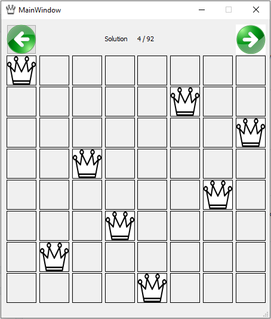

# Eight Queens Problem

This is an implementation of the eight queens problem in a recursive order.

Wikipedia link: https://en.wikipedia.org/wiki/Eight_queens_puzzle

Below is the algorithm:

Step 1: Iterate through the board for each square.

Step 2: Place the queen

Step 3: In a loop, check for all the squares in an order to see where the next queen can be placed.

Step 4: Check if all the eight queens are placed, else continue Step 3.

Step 5: If all the eight queens are placed successfully and it is not an existing solution, add to container of solutions.

Step 6: Remove the last queen location and continue to see if there are any more valid moves. Continue from Step 3.

