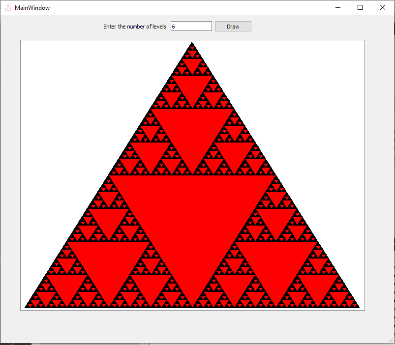

# This project display Sierpinski triangle using Qt, QtGraphicsScene

Wikipedia link: https://en.wikipedia.org/wiki/Sierpi%C5%84ski_triangle

Basic algorithm:
1. Draw siepinski for triangle A, B, C

2. For the first level, draw triangle for mid point of (A,B), (B,C) and (C,A)

3. Recursive for each further level Step 1 for A, mid point of (A,B) and (A,C)

4. Recursive for each further level Step 1 for B, mid point of (B,A) and (B,C)

5. Recursive for each further level Step 1 for C, mid point of (C,A) and (C,B)

